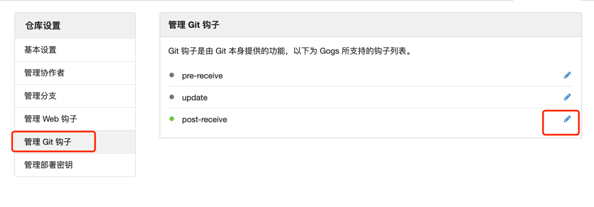
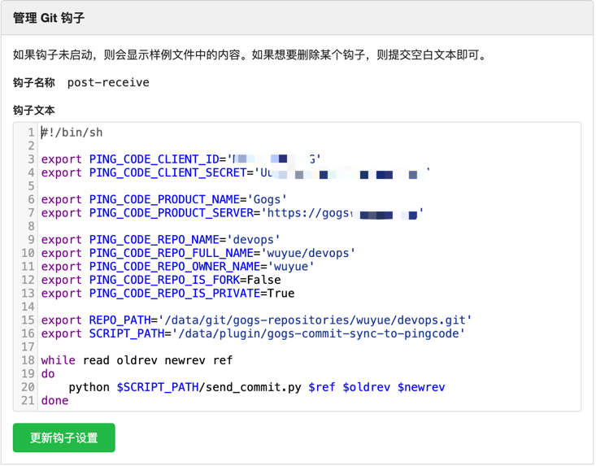
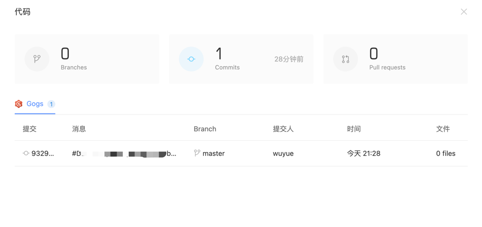

# gogs-commit-sync-to-pingcode

## 环境变量
```shell
# 在pingcode中申请凭据，类型为`client_credentials`，并将 开发 设置为读写
export PING_CODE_CLIENT_ID='<PING_CODE_CLIENT_ID>'
export PING_CODE_CLIENT_SECRET='<PING_CODE_CLIENT_SECRET>'

# 你的gogs托管仓库在pingcode中的名称
export PING_CODE_PRODUCT_NAME='<PING_CODE_PRODUCT_NAME>'
# 你的gogs托管仓库服务器地址
export PING_CODE_PRODUCT_SERVER='<PING_CODE_PRODUCT_SERVER>'

# 当前post-receive对应的repo名称 eg: test-repo
export PING_CODE_REPO_NAME='<PING_CODE_REPO_NAME>'
# 当前post-receive对应的repo全称 eg: wuyue/test-repo
export PING_CODE_REPO_FULL_NAME='<PING_CODE_REPO_FULL_NAME>'
# 当前post-receive对应的repo归属人 eg: wuyue
export PING_CODE_REPO_OWNER_NAME='<PING_CODE_REPO_OWNER_NAME>'
export PING_CODE_REPO_IS_FORK=False
export PING_CODE_REPO_IS_PRIVATE=False

# 当前post-receive对应的repo的仓库路径
export REPO_PATH='<REPO_PATH>'
# 本脚本放置的路径
export SCRIPT_PATH='<SCRIPT_PATH>'
```

## 安装
```shell
cd <install_path>
git clone https://github.com/wuyue92tree/gogs-commit-sync-to-pingcode.git
cd gogs-commit-sync-to-pingcode
pip install -r requirements.txt

# SCRIPT_PATH 即为 <install_path>/gogs-commit-sync-to-pingcode/send_commit.py
```

## 在gogs中配置post-receive




### post-receive详细配置示例
```shell
#!/bin/sh

export PING_CODE_CLIENT_ID='******'
export PING_CODE_CLIENT_SECRET='*********'

export PING_CODE_PRODUCT_NAME='Gogs'
export PING_CODE_PRODUCT_SERVER='https://gogs.***.***'

export PING_CODE_REPO_NAME='test-repo'
export PING_CODE_REPO_FULL_NAME='wuyue/test-repo'
export PING_CODE_REPO_OWNER_NAME='wuyue'
export PING_CODE_REPO_IS_FORK=False
export PING_CODE_REPO_IS_PRIVATE=True

export REPO_PATH='/data/git/gogs-repositories/wuyue/test-repo.git'
export SCRIPT_PATH='/data/plugin/gogs-commit-sync-to-pingcode'

while read oldrev newrev ref
do
    python $SCRIPT_PATH/send_commit.py $ref $oldrev $newrev
done
```
### 提交代码后，自动关联到项目



## 参考
[https://github.com/sunjingyun/git-commit-sync-to-pingcode](https://github.com/sunjingyun/git-commit-sync-to-pingcode)